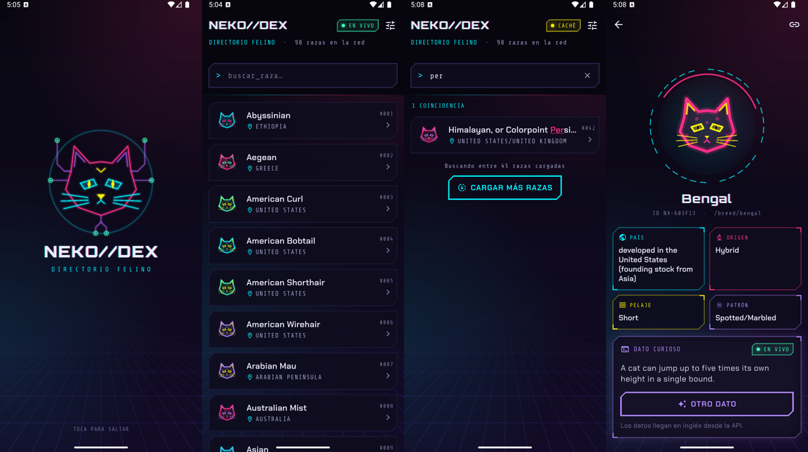
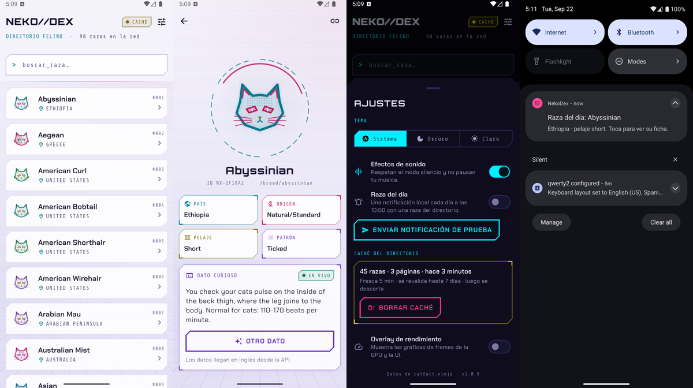
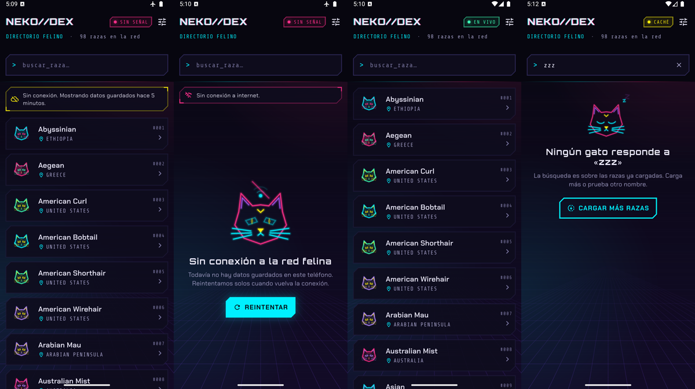
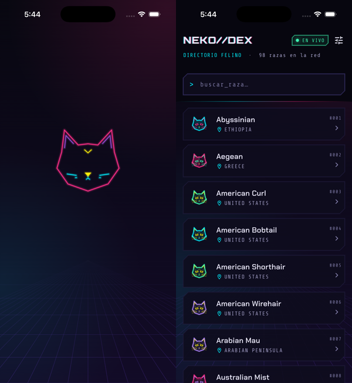
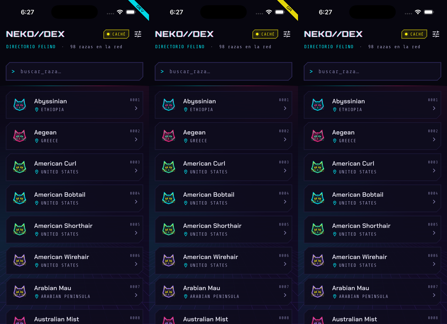
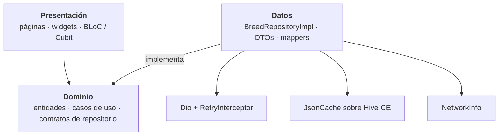
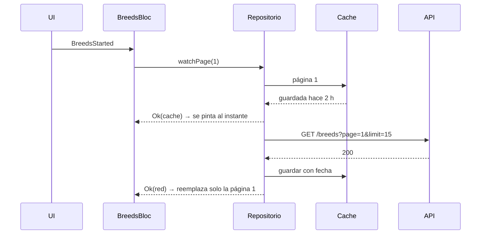
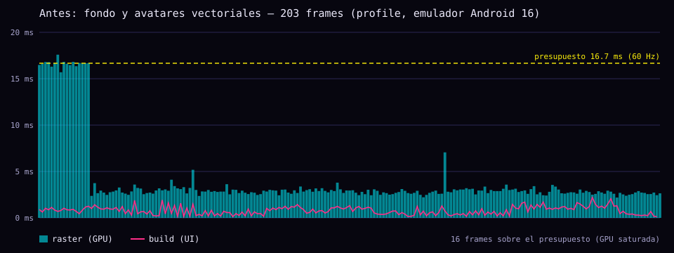
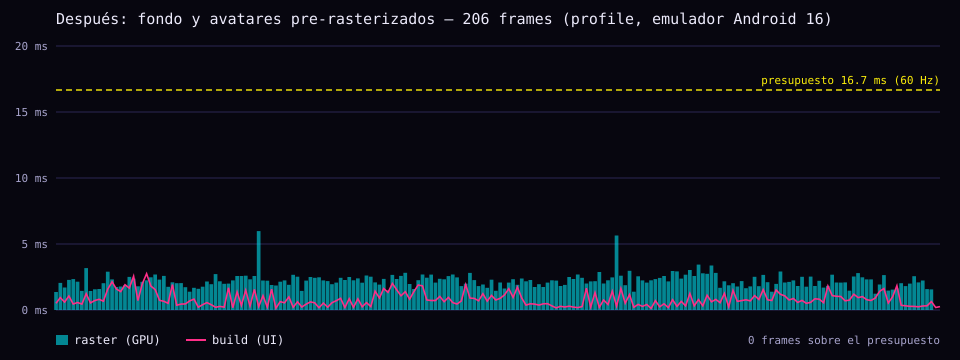
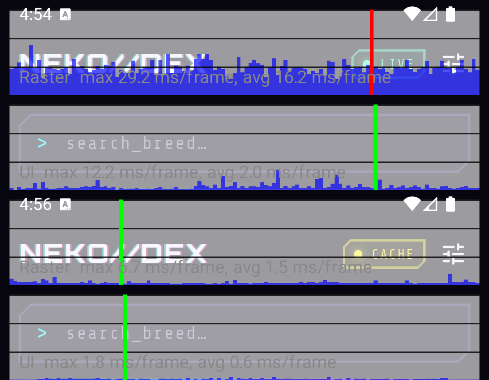

# NekoDex · cat-directory-app

[](https://github.com/aliatore/cat-test/actions/workflows/ci.yml)

Directorio de razas de gatos sobre la API pública de [Catfact Ninja](https://catfact.ninja/), hecho en Flutter para la prueba técnica Mobile de Nextep Innovation. Estética cyberpunk con gatos de neón, pensada para funcionar bien con mala conexión.

El proyecto se llama `cat_directory_app` (el `cat-directory-app` de la prueba, con guiones bajos porque Dart no acepta guiones en el nombre del paquete). El APK compilado está en [Releases](https://github.com/aliatore/cat-test/releases).





Las capturas son de un emulador Android 16; la misma app en el simulador de iOS (iPhone 17 Pro, iOS 26.3):



## Cómo ejecutarlo

Requisitos: Flutter **3.41.9** (Dart 3.11). El repo trae `.fvmrc`, así que con [FVM](https://fvm.app) basta con:

```bash
fvm install
fvm flutter pub get
fvm flutter run --flavor dev    # o qa / prod; sin --flavor compila prod
```

Sin FVM funciona igual con un Flutter 3.41.x en el `PATH` (`flutter pub get && flutter run --flavor dev`). El código generado (freezed, json_serializable, traducciones) está versionado, así que no hace falta correr `build_runner` para compilar. Si se cambian modelos:

```bash
fvm dart run build_runner build --delete-conflicting-outputs
```

Pruebas:

```bash
fvm flutter test                    # 87 pruebas unitarias y de widgets
fvm flutter test --coverage         # 66 % del código propio (sin generado)
```

Auditoría de scroll (necesita un dispositivo o emulador, en modo profile):

```bash
fvm flutter drive --profile --no-dds --flavor prod \
  --driver=test_driver/perf_driver.dart \
  --target=integration_test/scroll_performance_test.dart
```

### Ambientes: DEV, QA y PROD

Cada ambiente es un flavor nativo (`productFlavors` en Android, un scheme de Xcode en iOS), así que las tres apps se instalan lado a lado. En Dart, `AppEnvironment` sale del flavor (`appFlavor`) y reúne lo que cambia en el código.

| | DEV | QA | PROD |
|---|---|---|---|
| Nombre | NekoDex DEV | NekoDex QA | NekoDex |
| Android (`applicationId`) | `com.luisturiz.cat_directory_app.dev` | `….qa` | `com.luisturiz.cat_directory_app` |
| iOS (bundle id) | `com.luisturiz.catDirectoryApp.dev` | `….qa` | `com.luisturiz.catDirectoryApp` |
| Esquema de deep links | `nekodex-dev://` | `nekodex-qa://` | `nekodex://` |
| Revalidar al volver después de | 30 s | 1 min | 5 min |
| Logs de red en consola (debug) | sí | sí | no |
| Cinta en la esquina | cian | amarilla | — |



Los tres apuntan a `catfact.ninja` porque la API no tiene staging; la URL queda por ambiente para cuando exista. Sin `--flavor` se compila prod (`default-flavor` en `pubspec.yaml`), así que `flutter build apk` sigue dando el APK de producción. Los valores nativos están en `android/app/build.gradle.kts` e `ios/Flutter/flavors/`, y una prueba verifica que cada ambiente de Dart exista en las dos plataformas.

### VS Code

`.vscode/` trae la configuración lista y usa el SDK de FVM:

- **Depurar** (`launch.json`): NekoDex DEV, QA y PROD en modo debug, profile y release, las pruebas y *Adjuntar a la app abierta* para depurar un arranque desde un deep link o una notificación. Sobre `main()` aparecen *Debug* (DEV), *Debug QA* y *Debug PROD*.
- **Tareas** (`tasks.json`): código generado, traducciones, formato, análisis, pruebas y la secuencia completa de la CI; builds de APK, App Bundle, iOS e IPA que preguntan el ambiente; la traza de rendimiento; y abrir un deep link en Android o en el simulador eligiendo qué app lo recibe.
- **Ajustes** (`settings.json`): formato y orden de imports al guardar, regla en 80 columnas y los `.freezed.dart` / `.g.dart` anidados bajo su archivo.

Si pasas de un iPhone físico al simulador (o al revés) y la app se cierra al arrancar con `Failed to load dynamic library 'objective_c.framework'`, corre la tarea *Clean*: Flutter 3.41 guarda la librería nativa de `path_provider` en una sola carpeta para los dos destinos y reutiliza la del último build.

## Qué pedía la prueba y dónde está

| Requisito | Cómo se resolvió |
|---|---|
| Listado de razas (`/breeds`) con nombre y país | `SliverPrototypeExtentList`: filas de alto fijo medido con un prototipo, así la lista no mide fila por fila |
| Scroll infinito con control de concurrencia | El evento de página siguiente usa `droppable()`: mientras hay una petición en curso los demás se descartan. Además, las peticiones idénticas en vuelo se comparten en la fuente remota |
| Pull to refresh desde la página 1 | `RefreshIndicator` + evento propio. Si una página lenta llega después de un refresh, se descarta (ver *epoch* en `BreedsBloc`) |
| Búsqueda local con debounce | Transformador `debounce(300 ms)` + `restartable()`. Ignora mayúsculas y acentos ("perfoldae" encuentra "PerFoldæ") |
| Ruta parametrizada con GoRouter | `/breed/:name`, sub-ruta de `/`. Normaliza el nombre (`/breed/American%20Curl` → `/breed/american-curl`) |
| Offline-first | Al abrir sin red se pinta la última caché al instante (stale-while-revalidate) |
| Detalle con Breed, Country, Origin, Coat, Pattern | Ficha con cuadrícula de datos y Hero desde la fila |
| Dato curioso (`/fact`) con loading independiente | `CatFactBloc` propio: carga, falla y se reintenta sin tocar el resto de la ficha |
| Gestor de estado reactivo con transformación de eventos | BLoC (`flutter_bloc` + `bloc_concurrency` + `stream_transform`) |
| Arquitectura con separación de responsabilidades | Clean Architecture por feature: dominio puro, datos y presentación |
| Skeleton / loaders, snackbars y diálogos amigables | Skeletons con el mismo alto que las filas; avisos no bloqueantes; estados vacíos y de error ilustrados |
| Reintentos con backoff exponencial y límite | `RetryInterceptor` de Dio: 3 reintentos, 400/800/1600 ms con jitter, respeta `Retry-After` |
| Fallo en una página intermedia no borra la lista | El fallo queda en `paginationFailure`; la lista sigue y el pie ofrece reintentar |
| Modelos fuertemente tipados | `freezed` + `json_serializable`; DTOs separados de las entidades |
| Caché con invalidación explícita | Hive CE: TTL de 5 min, revalidación hasta 7 días, expiración, versión de esquema y purga al arrancar |
| Accesibilidad | Etiquetas semánticas en lista, buscador y estados; pruebas con las guías de Flutter; árbol de accesibilidad revisado en Android con TalkBack |
| Auditoría de performance | Traza en modo profile, PerformanceOverlay y `--analyze-size`, con el antes y el después ([abajo](#auditoría-de-performance)) |
| **Plus:** deep links nativos | App Links y Universal Links verificados en `luisturiz.com` (archivos en [`deeplinks/`](deeplinks/)) + esquema propio `nekodex://` (`nekodex-dev://` y `nekodex-qa://` en los otros ambientes) |
| **Plus:** dark mode | Sigue al sistema; también se puede fijar desde Ajustes |
| **Plus:** Hero | Avatar de la fila → holograma de la ficha |
| **Plus:** pruebas unitarias | 87 pruebas: repositorios, blocs, interceptor, caché, widgets, accesibilidad, rutas y ambientes |
| **Plus:** revalidar al volver a primer plano | `AppLifecycleListener`: tras 5 min en segundo plano se revalida la caché (30 s en DEV y 1 min en QA) |
| **Plus:** APK en releases | Sí |

Además de lo pedido: splash animado con Lottie, efectos de sonido, notificación local diaria ("raza del día"), español e inglés, avatares generados por código para cada raza y tres ambientes (DEV, QA y PROD) listos para depurar desde VS Code.

## Arquitectura

Feature-first con las capas de Clean Architecture dentro de cada feature. El dominio no conoce Flutter, Dio ni Hive; las pantallas no conocen el contenedor de dependencias (los blocs se los pasa el router).



```
lib/
├── app/                 # arranque, router, inyección de dependencias, splash
├── core/                # red (Dio, reintentos), caché, errores, Result, servicios
├── design_system/       # tema claro/oscuro, colores, tipografía y componentes neón
├── features/
│   ├── breeds/          # directorio y ficha
│   │   ├── domain/      # entidades, contrato del repositorio, casos de uso
│   │   ├── data/        # DTOs, fuentes remota y local, repositorio
│   │   └── presentation/# BreedsBloc, BreedDetailCubit, páginas y widgets
│   ├── facts/           # dato curioso (misma estructura)
│   ├── daily_breed/     # programación de la notificación diaria
│   └── settings/        # tema, sonido, notificaciones, caché
└── l10n/                # textos en español e inglés (ARB)
```

Los errores no viajan como excepciones: los repositorios devuelven `Result<T>` (`Ok` / `Err`) y los fallos son un `sealed class Failure` (sin red, timeout, servidor, límite de peticiones, parseo...). La presentación decide qué texto e ilustración le corresponde a cada uno.

### Por qué BLoC

- La prueba pide transformar eventos para evitar llamadas duplicadas o fuera de orden. En BLoC eso es parte del modelo: cada evento declara su concurrencia (`droppable` para paginar y refrescar, `debounce` + `restartable` para buscar) y se prueba igual que cualquier otro comportamiento.
- Los eventos explícitos dejan rastro: en debug se ve cada evento que entra al bloc, y con `bloc_test` cada escenario (cache → red, página lenta vs. refresh, reintento al volver la red) queda en una prueba legible.
- Para estados simples (la ficha, los ajustes, la caché) se usa `Cubit`, sin eventos que no aportan nada.

## Offline-first y caché

La API responde `Cache-Control: no-cache` y no expone `ETag` ni `Last-Modified`, así que la frescura se decide en el cliente con una política explícita:

| Edad de la página guardada | Qué pasa |
|---|---|
| Menos de 5 min | Se sirve tal cual, sin tocar la red |
| De 5 min a 7 días | Se muestra al instante y se revalida en segundo plano (stale-while-revalidate) |
| Más de 7 días | Se invalida y se borra; al arrancar se purgan todas las vencidas |
| Otra versión de esquema | Se descarta (subir `cacheSchemaVersion` invalida toda la caché tras una actualización) |
| Pull to refresh | Ignora la frescura y va a la red |

Se guarda cada página que se visita (no solo la primera), con el tamaño de página dentro de la clave para no mezclar geometrías si cambia entre versiones. La caché vive en *Application Support* y no en *Documents*: es caché, no un archivo del usuario.



Otras piezas del comportamiento sin red:

- **Reintentos con backoff:** `RetryInterceptor` reintenta desconexiones, timeouts, 5xx y 429 hasta 3 veces (400 ms, 800 ms, 1.6 s, con jitter para no llegar todos a la vez), solo en métodos idempotentes, y respeta `Retry-After`. Mientras reintenta, la UI muestra "Reconectando… intento 2 de 3".
- **Conectividad:** si no hay ninguna interfaz de red no se intenta la petición (se ahorran los reintentos). Al volver la señal, el bloc reintenta solo lo que había fallado: la página intermedia, la carga inicial o la revalidación de una caché vieja.
- **Primer plano:** si la app estuvo más de 5 minutos en segundo plano, al volver se revalida la página 1.
- **Deep links sin red:** una ficha se resuelve desde memoria o caché; si no está, se recorre la API página a página (y de paso se calienta la caché).
- **Dato curioso sin red:** se guardan los últimos 30 datos vistos y, sin conexión, se muestra uno de ellos marcado como "Guardado".

### Qué ve el usuario cuando algo falla

| Situación | Respuesta |
|---|---|
| Abre la app sin red y hay caché | Lista al instante, chip **SIN SEÑAL** y banner "Mostrando datos guardados hace 12 minutos" |
| Abre la app sin red y sin caché | Ilustración, explicación y **Reintentar**; además reintenta sola cuando vuelve la red |
| La red cae a mitad del scroll | La lista se queda; el pie dice que no se pudo cargar la página y ofrece reintentar |
| Vuelve la red | "Conexión restablecida" y se reanuda lo pendiente sin tocar nada |
| Red inestable | Reintentos silenciosos con el número de intento visible |
| La API devuelve 429 | Aviso específico ("la API pide un respiro") y reintento con la espera que indica el servidor |
| Pull to refresh sin red | La lista actual se mantiene y un aviso ofrece reintentar |
| Link a una raza que no existe | Pantalla "Esa raza no está en el directorio" con acceso al listado |
| Falla solo el dato curioso | Se queda en su tarjeta, con su propio reintento |
| Datos sucios de la API | Nombres como `Foldex[4]` o `PerFoldæ(Experimental…)` se limpian; campos vacíos muestran "Sin datos" |

## Auditoría de performance

Medido en un emulador Android 16 (arm64) en **modo profile**, con las 98 razas cargadas: la prueba de integración carga el directorio completo y después traza 32 flings arriba y abajo.

**La primera medición no fue buena.** El hilo de UI estaba holgado, pero 16 frames pasaban el presupuesto de raster y el PerformanceOverlay marcaba ~16 ms de raster medio con scroll rápido. La traza mostró que el trabajo de codificar cada frame era de ~1.8 ms y que el resto se iba en `SurfaceFrame::Submit`, esperando a la GPU.

La causa: con **Impeller no hay raster cache**. Un `RepaintBoundary` evita volver a grabar el dibujo, pero la GPU lo vuelve a pintar en cada frame. El fondo (degradados a pantalla completa, halos, retícula y ~300 líneas de scanlines) y los trazos de cada avatar se repintaban en cada frame del scroll. La solución fue rasterizarlos **una sola vez** a textura (`Picture.toImageSync`) y componer solo esa imagen en cada frame; los avatares de la lista pasan por un LRU de texturas y en la ficha siguen siendo vectoriales para que el Hero escale nítido.

| Traza | Antes (203 frames) | Después (206 frames) |
|---|---|---|
| Build (UI) promedio / p99 / peor | 0.79 / 1.92 / 2.20 ms | 0.81 / 2.14 / 2.75 ms |
| Raster promedio / p90 / p99 | 4.04 / 3.80 / 16.82 ms | **2.22 / 2.69 / 3.44 ms** |
| Peor frame de raster | 17.59 ms | **5.98 ms** |
| Frames que pasan el presupuesto (16.7 ms) | 16 | **0** |




PerformanceOverlay con el mismo scroll rápido, antes (arriba) y después (abajo):



| PerformanceOverlay | Antes | Después |
|---|---|---|
| Raster máx. / promedio | 29.2 / 16.2 ms | **6.7 / 1.5 ms** |
| UI máx. / promedio | 12.2 / 2.0 ms | **1.8 / 0.6 ms** |

Los resúmenes completos están en [`docs/performance/`](docs/performance/). Las cifras son de emulador: la GPU emulada es más lenta que la de un teléfono real, así que en dispositivo el margen debería ser mayor, pero conviene repetir la traza en hardware antes de dar números de producción. El overlay se puede activar desde **Ajustes → Overlay de rendimiento**.

### Tamaño (`flutter build apk --analyze-size --target-platform android-arm64`)

APK de release arm64: **20.4 MB** ([salida completa](docs/performance/analyze-size.txt)).

| Parte | Tamaño | Comentario |
|---|---|---|
| `libflutter.so` (motor) | 11.0 MB | Fijo de Flutter |
| `libapp.so` (Dart AOT) | 7.2 MB | `package:flutter` 3 MB, `lottie` 360 KB, código de la app 258 KB, `flutter_localizations` 164 KB, `hive_ce` 97 KB, `timezone` 80 KB, `go_router` 70 KB, `dio` 47 KB |
| Assets de Flutter | 365 KB | Fuentes 186 KB, licencias 120 KB, sonidos 37 KB, animaciones Lottie 6 KB |
| Recursos Android | 373 KB | Íconos y el sonido de la notificación (78 KB, WAV porque iOS no acepta MP3 para notificaciones) |

Dos incrementos se detectaron y se corrigieron: la base completa de zonas horarias (`timezone/latest_all`, **451 KB**) se cambió por la de 10 años (**80 KB**), suficiente para programar la semana siguiente; y los efectos de sonido en WAV (**323 KB**) pasaron a MP3 (**37 KB**). En total el APK bajó de 21.0 a 20.4 MB.

## Accesibilidad

- Cada fila se anuncia como un botón con nombre y país ("Abyssinian. País: Ethiopia.") y la pista "ver ficha". Los estados de carga, error, vacío, el banner de red y el dato curioso son *live regions*: el lector los anuncia al aparecer.
- El buscador tiene etiqueta propia ("Buscar raza por nombre"); los interruptores de Ajustes se leen como un solo control con su descripción y su estado.
- El texto con efecto glitch y la máquina de escribir son solo visuales: el lector recibe el texto completo una vez.
- "Reducir movimiento" del sistema apaga las animaciones decorativas (glitch, anillo, skeletons, entradas) y acorta el splash.
- Pruebas automáticas con las guías de Flutter (`androidTapTargetGuideline`, `iOSTapTargetGuideline`, `labeledTapTargetGuideline`, `textContrastGuideline`) en modo claro y oscuro.
- Verificación en Android sobre el árbol de accesibilidad real (el que recorre TalkBack, extraído con `uiautomator`) y con TalkBack activado en el emulador. Esa revisión encontró un fallo real: las filas se anunciaban como botón pero **no se podían activar** porque `excludeSemantics` descartaba el `onTap` del `InkWell`. Está corregido y cubierto por una prueba.

Árbol de la ficha tal como lo expone Android (app en español):

```
Button  "Atrás"
Button  "Copiar enlace"
Button  "Avatar de Abyssinian"          pista: "Tócalo para acariciarlo"
View    "Abyssinian"                    (encabezado)
View    "País: Ethiopia"
View    "Origen: Natural/Standard"
View    "Pelaje: Short"
View    "Patrón: Ticked"
View    "DATO CURIOSO"
View    "While many parts of Europe and North America consider the black cat…"
Button  "OTRO DATO"
```

Pendiente: recorrer la app con gestos de TalkBack en un teléfono físico (en el emulador los toques inyectados por `adb` se comportan como clics, no como gestos del lector) y una pasada con VoiceOver en iPhone. La semántica es la misma en las dos plataformas.

## Diseño

- **Paleta Night City** (cian, magenta, amarillo ácido, morado y menta sobre casi negro) con una versión de día que oscurece los acentos para pasar contraste AA en fondo claro.
- **Tipografías** con roles claros: Orbitron para la marca, Chakra Petch para leer y Share Tech Mono para datos y estados. Están incluidas en el APK (licencia OFL): nada se descarga en tiempo de ejecución, así que la primera apertura sin red se ve igual.
- **Avatares procedurales:** cada raza tiene un gato de neón propio, siempre el mismo, generado por código a partir de su nombre. El dibujo sale del patrón real del pelaje (rayas para *tabby*, manchas para *spotted*, puntas oscuras para *colorpoint*, arrugas para las razas sin pelo...) y los pelajes largos llevan mechones.
- **Animaciones:** splash con Lottie (el gato se dibuja, se encienden los ojos, crecen circuitos y un glitch); Hero del avatar; entrada escalonada de filas solo la primera vez que aparecen; skeletons con barrido; texto glitch en ráfagas cortas (no repinta en reposo).
- **Sonido y háptica:** arranque, toques, maullido al acariciar el avatar, confirmación y error. Usan la categoría de audio *ambient* en iOS y no piden foco en Android: respetan el modo silencio y no pausan la música del usuario. Se pueden apagar en Ajustes.
- Las animaciones Lottie, los sonidos y el ícono son originales: se generan con los scripts de [`tool/`](tool/) (Python sin dependencias), así que no hay licencias de terceros de por medio.

## Notificaciones locales

**Raza del día:** al activarla en Ajustes se pide el permiso en ese momento (no al abrir la app) y se programan los próximos 7 días a las 10:00 hora local, cada día con una raza distinta (la misma fecha siempre da la misma raza). Se reprograman en cada arranque con la caché más reciente. Tocar la notificación abre la ficha de esa raza, también con la app cerrada.

- Android: canal propio con el maullido como sonido, ícono monocromo, alarmas inexactas (no exigen el permiso de alarmas exactas de Android 14) y reprogramación tras reiniciar el teléfono.
- iOS: configuradas para mostrarse también con la app abierta y con el mismo sonido (el archivo va en el bundle de Runner). El flujo completo (permiso, entrega, toque → ficha, arranque en frío desde la notificación) está probado en Android; en iOS falta probarlo en un dispositivo.
- **Enviar notificación de prueba** en Ajustes muestra una al instante.

## Deep links

```bash
# Esquema propio, funciona en cualquier instalación (nekodex-dev:// y nekodex-qa:// abren DEV y QA)
adb shell am start -a android.intent.action.VIEW -d "nekodex://open/breed/american-curl"
xcrun simctl openurl booted "nekodex://open/breed/american-curl"

# App Link / Universal Link: abre la app directo, sin navegador ni selector
adb shell am start -a android.intent.action.VIEW -d "https://luisturiz.com/breed/american-curl"
xcrun simctl openurl booted "https://luisturiz.com/breed/american-curl"
```

La app declara `https://luisturiz.com/breed/*` (Android con `autoVerify` y iOS con *Associated Domains*). Los archivos de verificación están publicados en [`luisturiz.com/.well-known/assetlinks.json`](https://luisturiz.com/.well-known/assetlinks.json) y [`luisturiz.com/.well-known/apple-app-site-association`](https://luisturiz.com/.well-known/apple-app-site-association) (la fuente está en [`deeplinks/.well-known/`](deeplinks/)), con el paquete, el bundle id, el Team ID y la huella del certificado del APK de Releases. Los dos sistemas verifican el dominio: en Android `pm get-app-links` marca `luisturiz.com: verified` y en iOS la CDN de Apple ya sirve la asociación. Probado con la app cerrada en el emulador de Android y en el simulador de iOS: el link abre la ficha directo, sin pasar por el navegador.

DEV y QA declaran el mismo dominio, pero los archivos solo incluyen el paquete y el bundle id de prod: los links `https` abren PROD, y DEV y QA se prueban con su esquema. El APK que genera la CI se firma con la clave de debug del runner, así que en ese APK el dominio no verifica; en el de Releases sí.

## Pruebas

- **Datos:** stale-while-revalidate (caché fresca, vieja, vencida, sin red), respaldo a caché cuando falla la red, resolución de deep links, purga, fuente remota (parseo y peticiones compartidas).
- **Red:** reintentos, crecimiento exponencial, `Retry-After`, límite de intentos, métodos no idempotentes.
- **Blocs:** arranque con caché y luego red, errores bloqueantes vs. avisos, paginación sin duplicados, página lenta después de un refresh, búsqueda con debounce, reintento al volver la conexión, dato curioso.
- **Widgets y rutas:** estados de la pantalla, accesibilidad, normalización de `/breed/:name`, pila de navegación de un deep link y 404.
- **Ambientes:** flavor → `AppEnvironment`, la cinta de DEV y QA, y que cada ambiente exista como flavor en Android e iOS.
- **Integración:** traza de scroll en modo profile.

La CI (GitHub Actions) comprueba formato, análisis estático, que el código generado esté al día y las pruebas, y compila el APK y la app de iOS del flavor prod.

## Decisiones y límites

- **Hive CE** (el fork mantenido de Hive) en lugar de sqflite: es Dart puro, lee de memoria tras abrir la caja y la caché es un JSON por página; no hacía falta SQL.
- **Ambientes con flavors nativos** y no con `--dart-define-from-file`: el flavor cambia el id, el nombre y el esquema de la app en cada plataforma (por eso se instalan lado a lado), y Dart lo lee con `appFlavor`. En Flutter 3.41 los valores de `--dart-define-from-file` solo llegan a Gradle y a Xcode codificados dentro de `DART_DEFINES`, así que lograr lo mismo exigía decodificarlos en los scripts de build.
- **15 razas por página:** la API tiene 98; con 15 el scroll infinito se ejercita de verdad (7 páginas).
- **La búsqueda es local**, como pide la prueba: filtra lo cargado y ofrece cargar más si lo buscado todavía no llegó.
- **Datos curiosos en inglés:** vienen así de la API; la ficha lo aclara.
- **Firma del APK:** el de Releases está firmado con la clave de debug de este equipo. Para firmar de verdad basta con un `android/key.properties` (ver `android/app/build.gradle.kts`) y actualizar la huella en `assetlinks.json`.
- **Métricas de emulador:** ver la nota de la auditoría.
