# NekoDex · Manual de usuario

**Versión 1.0 · septiembre de 2026 · app 1.0.0**

NekoDex es un directorio de razas de gatos con estética cyberpunk. Permite recorrer las 98 razas que publica [Catfact Ninja](https://catfact.ninja/), buscar por nombre y abrir la ficha de cada raza con un dato curioso. Está pensada para funcionar con mala conexión: guarda lo que ya viste y te lo sigue mostrando aunque no haya internet.

Este manual explica cómo instalarla y cómo se usa cada pantalla. Las capturas son de un teléfono Android con la app en español; en iPhone las pantallas son iguales.

## 1. Instalación

### Android

1. Necesitas **Android 7.0 o superior**.
2. Descarga `nekodex-1.0.0.apk` desde [Releases](https://github.com/aliatore/cat-test/releases) en el teléfono.
3. Ábrelo. Si Android avisa que la app viene de un origen desconocido, permite la instalación para el navegador o el gestor de archivos que estés usando (solo hace falta una vez).
4. La app aparece en el cajón de aplicaciones como **NekoDex**.

### iPhone

La app funciona en **iOS 13 o superior**, pero no hay una versión pública para instalar: para distribuirla por TestFlight o App Store hace falta la cuenta de desarrollador del equipo. Se instala compilándola desde el código, como explica el [manual técnico](manual-tecnico.md).

## 2. Primer uso

  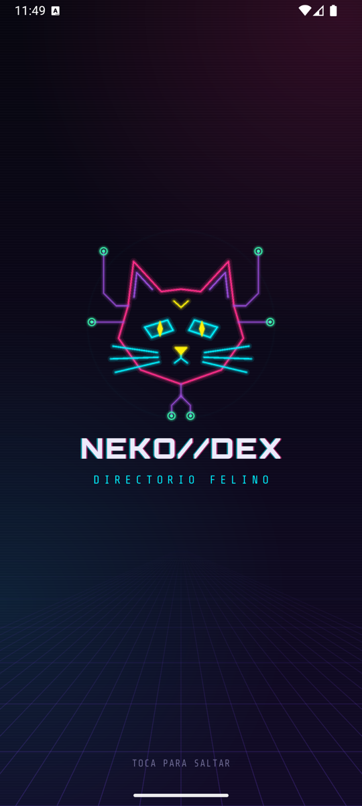

- Al abrir la app aparece la animación de arranque. **Toca la pantalla para saltarla.** Si el teléfono tiene activado *Quitar animaciones* (Android) o *Reducir movimiento* (iPhone), la animación es más corta y sin efectos.
- La app no pide permisos al abrirse. El de notificaciones se pide solo cuando activas la *Raza del día* o envías una notificación de prueba (ver sección 7).
- **La primera vez necesita internet** para descargar el directorio. Desde entonces lo guarda en el teléfono y puedes consultarlo sin conexión.

## 3. El directorio

  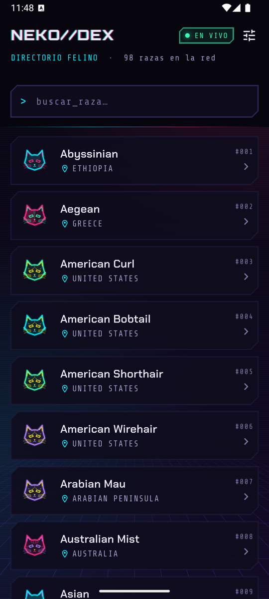
  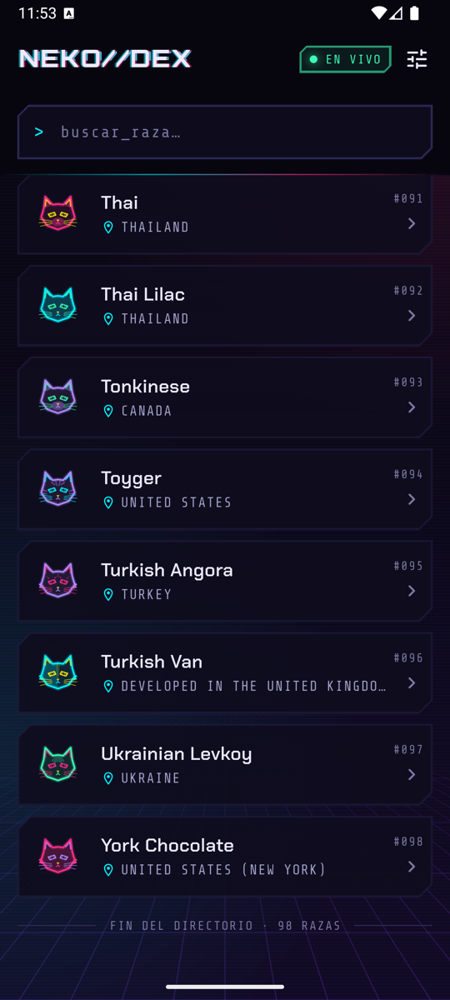

Es la pantalla principal. Cada fila muestra:

- un **avatar** dibujado según el patrón de pelaje de la raza (rayas, manchas, puntas, bicolor…),
- el **nombre** de la raza y su **país**,
- su **número** dentro del directorio (`#001`, `#002`…).

Arriba a la derecha, un chip indica de dónde vienen los datos que estás viendo:

| Chip | Significa |
|---|---|
| **EN VIVO** | Datos recién traídos de internet. |
| **CACHÉ** | Datos guardados en el teléfono: todavía son recientes o no se pudieron actualizar. |
| **SINCRONIZANDO** | La app está actualizando o reintentando una conexión. |
| **SIN SEÑAL** | El teléfono no tiene conexión; ves lo que estaba guardado. |

Cómo moverte por la lista:

- **Desplázate hacia abajo** y las siguientes razas se cargan solas, de 15 en 15. Al llegar al final verás *Fin del directorio · 98 razas*.
- **Desliza hacia abajo desde el principio de la lista** para recargarla desde la primera página. Al terminar aparece el aviso *Directorio actualizado*.
- **Toca una fila** para abrir la ficha de esa raza.

## 4. Buscar una raza

  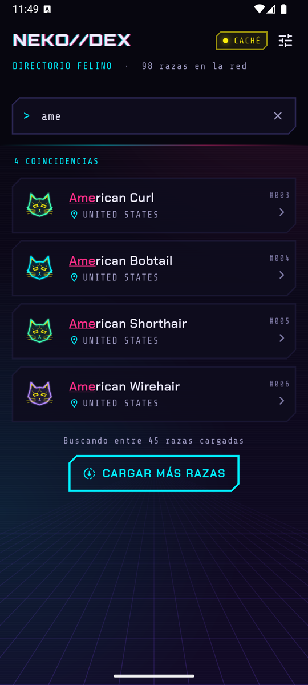
  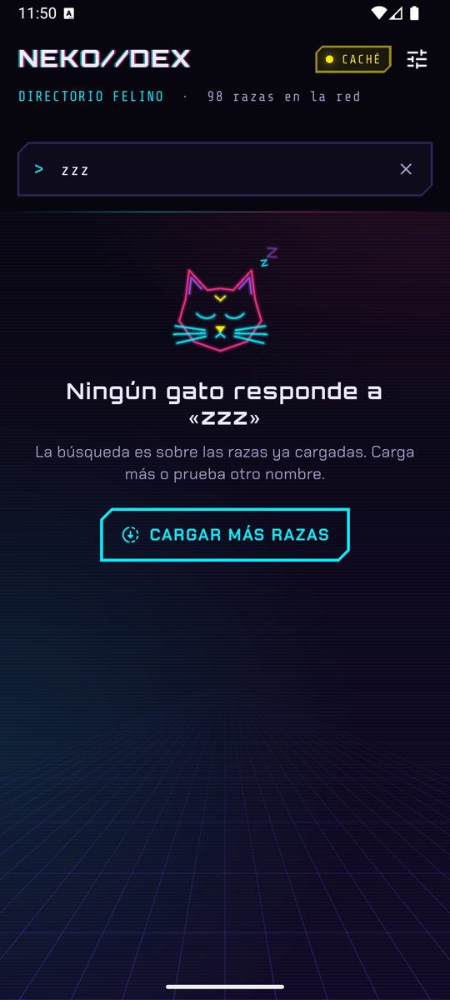

1. Toca el campo `buscar_raza…` y escribe parte del nombre. La lista se filtra mientras escribes y resalta lo que coincide.
2. No importan las mayúsculas ni los acentos: *perfold* encuentra *PerFoldæ*.
3. La búsqueda es **sobre las razas que ya se cargaron**. Debajo de los resultados verás cuántas son (*Buscando entre 45 razas cargadas*) y el botón **Cargar más razas** para traer la página siguiente si lo que buscas todavía no llegó.
4. Si nada coincide, la app lo dice (*Ningún gato responde a «zzz»*) y ofrece cargar más razas.
5. Toca la **×** del campo para borrar la búsqueda.

## 5. La ficha de una raza

  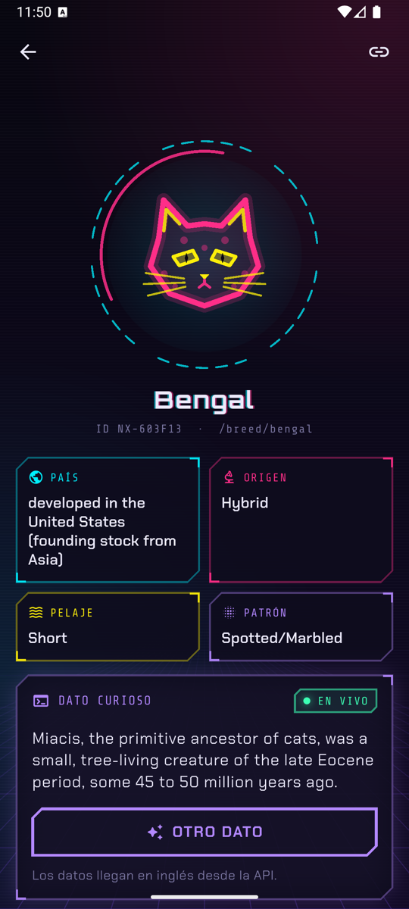

La ficha reúne toda la información de la raza:

- **País, Origen, Pelaje y Patrón.** Si la API no trae alguno de estos datos, aparece *Sin datos*.
- **El avatar holográfico.** Tócalo para acariciarlo: maúlla y el teléfono vibra.
- **Dato curioso.** Se carga aparte, así que el resto de la ficha se ve aunque este dato tarde o falle. **Otro dato** trae uno nuevo. El chip **EN VIVO** indica que viene de internet; **GUARDADO**, que no hay conexión y se muestra uno que ya habías visto. Los datos llegan en inglés desde la API.
- **Copiar enlace** (ícono de enlace, arriba a la derecha): copia la dirección de la ficha, por ejemplo `https://luisturiz.com/breed/bengal`, para compartirla. Verás *Enlace copiado*.
- **Volver** (flecha, arriba a la izquierda) regresa al directorio.

## 6. Sin conexión o con conexión inestable

  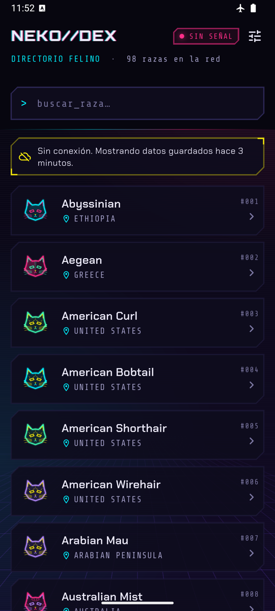
  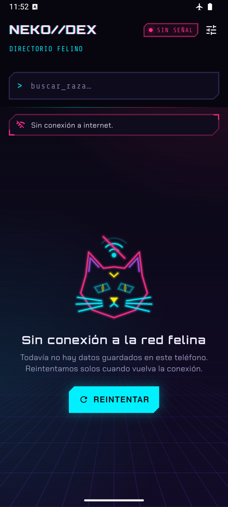
  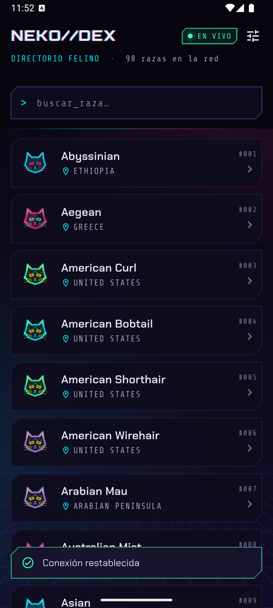

NekoDex está pensada para seguir siendo útil cuando la red falla. Esto es lo que verás en cada caso:

| Situación | Qué muestra la app | Qué hacer |
|---|---|---|
| Sin internet, con datos guardados | La lista de siempre, chip **SIN SEÑAL** y el aviso *Sin conexión. Mostrando datos guardados hace 3 minutos.* | Nada: puedes navegar y buscar entre lo guardado. |
| Sin internet y sin datos guardados | *Sin conexión a la red felina* y el botón **Reintentar**. | Conéctate. La app reintenta sola cuando vuelve la conexión. |
| La conexión vuelve | *Conexión restablecida* y los datos se actualizan solos. | Nada. |
| Conexión inestable | *Reconectando… intento 2 de 3*: la app reintenta sola antes de mostrar un error. | Esperar unos segundos. |
| Falla la carga de más razas | La lista ya cargada se queda y el pie dice *No se pudo cargar la página siguiente. La lista sigue aquí.* | Tocar **Reintentar**. |
| Recargar la lista sin conexión | *No se pudo actualizar. La lista sigue disponible.* | Reintentar con conexión. |
| Datos guardados de hace tiempo | *Datos guardados hace 2 horas. Actualizando en segundo plano…* | Nada: se reemplazan solos al llegar los nuevos. |
| El servidor está saturado | *La API pide un respiro. Reintenta en unos segundos.* | Esperar y reintentar. |
| Un enlace a una raza que no existe | *Esa raza no está en el directorio* y **Ir al directorio**. | Buscarla en el listado. |

Además, si la app estuvo un rato en segundo plano (5 minutos), al volver a ella revisa si hay datos nuevos.

## 7. Ajustes

  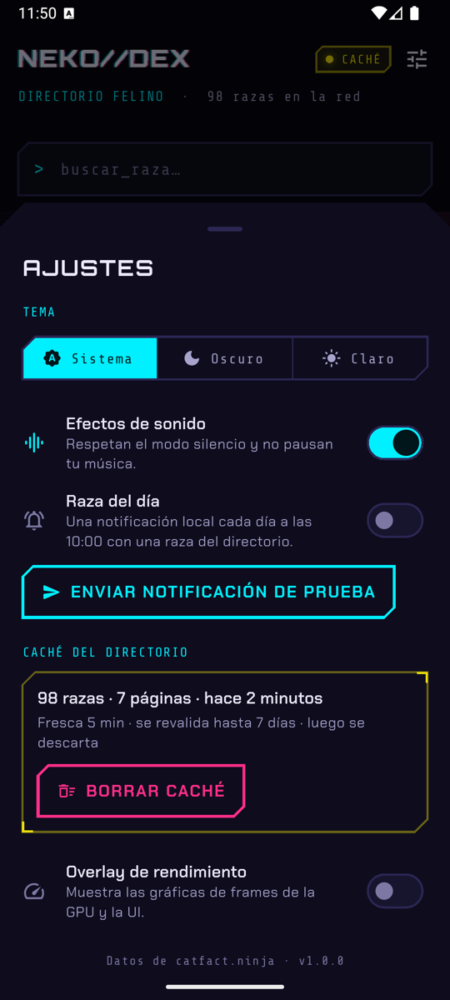
  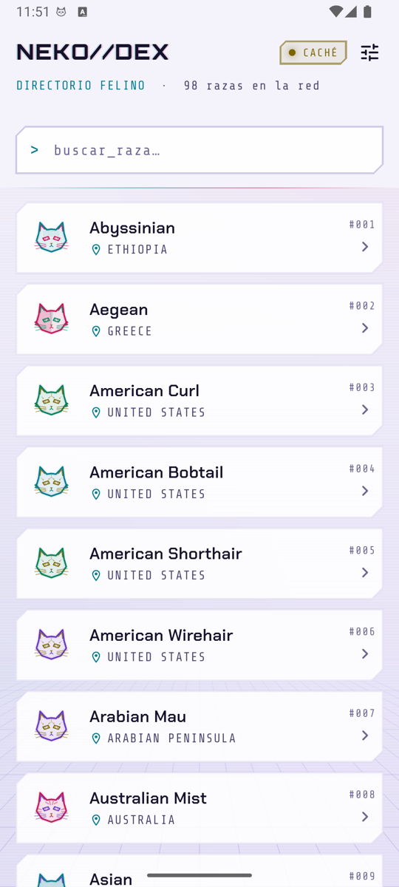

Se abren con el ícono de ajustes, arriba a la derecha del directorio.

- **Tema.** *Sistema* sigue el modo claro u oscuro del teléfono; *Oscuro* y *Claro* lo fijan.
- **Efectos de sonido.** Activa o apaga los sonidos de la app. Respetan el modo silencio y no pausan la música que estés escuchando.
- **Raza del día.** Programa una notificación diaria a las **10:00** con una raza del directorio (ver abajo).
- **Enviar notificación de prueba.** Muestra al instante la notificación de hoy para ver cómo llega.
- **Caché del directorio.** Resume lo guardado (*98 razas · 7 páginas · hace 2 minutos*) y explica cuánto dura: los datos se consideran frescos 5 minutos, se revisan contra internet hasta 7 días y después se descartan. **Borrar caché** libera ese espacio; el directorio se vuelve a descargar desde internet.
- **Overlay de rendimiento.** Muestra sobre la app las gráficas de tiempo de dibujo. Es una herramienta de diagnóstico; no hace falta activarla.
- Al pie aparece la versión de la app.

### La notificación «Raza del día»

  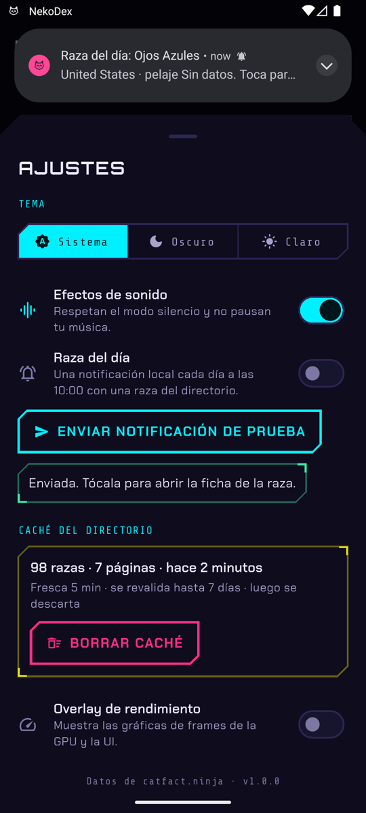

1. Activa **Raza del día**. La primera vez el teléfono te pedirá permiso para mostrar notificaciones: acéptalo.
2. La app programa los próximos 7 días a las 10:00 (hora del teléfono), cada día con una raza distinta. Cada vez que abres la app se reprograman con los datos más recientes.
3. **Toca la notificación** para abrir la ficha de esa raza, incluso si la app estaba cerrada.

Si las notificaciones no llegan:

- Si rechazaste el permiso, la app lo avisa en Ajustes (*Las notificaciones de NekoDex están desactivadas en el sistema.*) y el botón **Abrir ajustes** te lleva a la configuración del teléfono para activarlas.
- Si nunca abriste el directorio con conexión, no hay razas guardadas para programar; la app lo indica y basta con abrirlo una vez con internet.
- En Android pueden llegar con unos minutos de diferencia: el sistema agrupa las alarmas para ahorrar batería. El modo *No molestar* también las silencia.

## 8. Abrir NekoDex desde un enlace

Los enlaces del tipo `https://luisturiz.com/breed/<raza>` abren directamente la ficha de esa raza en el teléfono que tiene NekoDex instalada, sin pasar por el navegador. Funcionan en Android e iPhone, también con la app cerrada. Si la app no está instalada, el enlace abre el sitio web.

Para compartir una raza, usa **Copiar enlace** en su ficha.

## 9. Idioma y accesibilidad

- **Idioma.** La app está en español e inglés y usa el idioma del teléfono. Si quieres NekoDex en otro idioma que el del teléfono, cámbialo solo para la app desde la configuración del sistema: en Android 13 o superior, *Ajustes → Apps → NekoDex → Idioma*; en iPhone, *Ajustes → NekoDex → Idioma preferido*. Los datos curiosos siempre llegan en inglés.
- **Lectores de pantalla.** Funciona con TalkBack y VoiceOver: cada fila se lee con el nombre y el país de la raza ("Abyssinian. País: Ethiopia.") y los avisos de carga, error o conexión se anuncian al aparecer.
- **Menos movimiento.** Con *Quitar animaciones* o *Reducir movimiento* activado en el teléfono, la app apaga las animaciones decorativas (el efecto glitch, el anillo del holograma, el brillo de los skeletons y las entradas de la lista) y acorta la de arranque.

## 10. Preguntas frecuentes

**¿Por qué los datos curiosos están en inglés?**
Porque la API de Catfact Ninja solo los publica en inglés.

**¿Por qué algunas razas dicen «Sin datos»?**
La API no trae ese campo para esa raza. La app lo indica en lugar de dejar el espacio vacío.

**¿Gasta muchos datos móviles?**
No. Descarga el directorio en páginas pequeñas (15 razas) y, mientras los datos guardados son recientes, no vuelve a pedirlos.

**¿Cómo libero espacio?**
En *Ajustes → Caché del directorio → Borrar caché*.

**¿Se puede usar sin internet?**
Sí, con todo lo que ya se cargó alguna vez: la lista, la búsqueda, las fichas y los últimos datos curiosos vistos.

## Anexo: versiones de prueba (DEV y QA)

  

Además de la app publicada, existen dos versiones internas para desarrollo y pruebas. Se instalan junto a la normal sin reemplazarla:

| Versión | Nombre en el teléfono | Cómo se reconoce |
|---|---|---|
| Desarrollo | NekoDex DEV | Cinta **DEV** cian en la esquina |
| Pruebas | NekoDex QA | Cinta **QA** amarilla en la esquina |
| Publicada | NekoDex | Sin cinta |

Funcionan igual que la publicada. Revisan antes si hay datos nuevos al volver del segundo plano (30 segundos en DEV y 1 minuto en QA), para poder probarlo sin esperar cinco minutos. Los enlaces `https` abren siempre la versión publicada.
