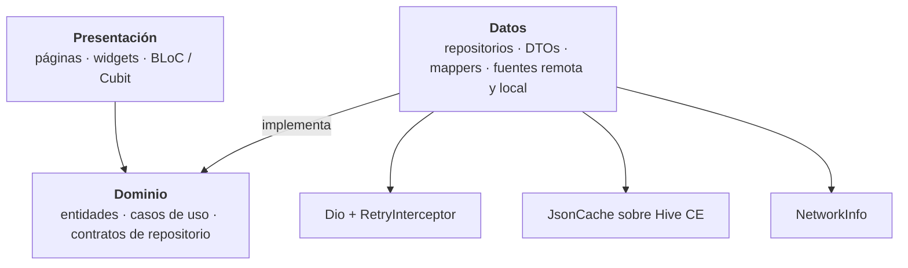
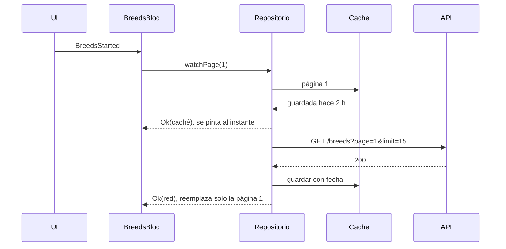
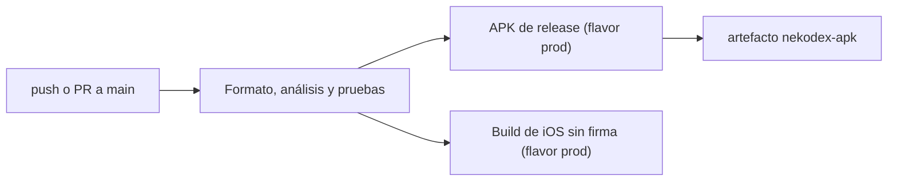

# NekoDex · Manual técnico

**Versión 1.0 · septiembre de 2026 · código en `main` · Flutter 3.41.9**

Este manual describe cómo está construida NekoDex (`cat_directory_app`), cómo se levanta el entorno de desarrollo y cómo se mantiene. Está dirigido a quien vaya a revisar, compilar o extender el proyecto. La guía de uso de la app está en el [manual de usuario](manual-de-usuario.md).

## 1. Resumen del sistema

| | |
|---|---|
| Qué es | Directorio de razas de gatos sobre la API pública de [Catfact Ninja](https://catfact.ninja/), con ficha por raza y dato curioso aleatorio |
| Plataformas | Android 7.0+ (API 24) e iOS 13+ |
| Framework | Flutter 3.41.9 · Dart 3.11.5, fijados con FVM (`.fvmrc`) |
| Paquete Dart | `cat_directory_app` (el nombre `cat-directory-app` de la prueba, con guiones bajos porque Dart no admite guiones) |
| Ids de la app | Android `com.luisturiz.cat_directory_app` · iOS `com.luisturiz.catDirectoryApp` (+ `.dev` / `.qa` en los otros ambientes) |
| Idiomas | Español (base) e inglés |
| Repositorio | [github.com/aliatore/cat-test](https://github.com/aliatore/cat-test) · binario en [Releases](https://github.com/aliatore/cat-test/releases) |

Funcionalidad principal: listado con scroll infinito y control de concurrencia, pull to refresh, búsqueda local con debounce, ruta `/breed/:name` con GoRouter, offline-first con stale-while-revalidate, detalle con dato curioso de carga independiente, reintentos con backoff exponencial, caché con invalidación explícita, deep links verificados, modo oscuro, Hero, notificación local diaria y revalidación al volver a primer plano.

## 2. Stack y dependencias

| Área | Paquete | Uso |
|---|---|---|
| Estado | `bloc` 9, `flutter_bloc` 9 | BLoC y Cubit |
| Estado | `bloc_concurrency` 0.3, `stream_transform` 2 | `droppable`, `restartable` y `debounce` de eventos |
| Navegación | `go_router` 17 | Rutas declarativas, ruta parametrizada y deep links |
| Red | `dio` 5 | Cliente HTTP con interceptores |
| Persistencia | `hive_ce` 2 | Caché clave-valor (fork mantenido de Hive) |
| Conectividad | `connectivity_plus` 7 | Estado de la red |
| Modelos | `freezed` 3, `json_serializable` 6 | Entidades inmutables, uniones selladas y JSON |
| Inyección | `get_it` 9 | Contenedor de dependencias en la raíz de composición |
| Experiencia | `lottie` 3, `flutter_animate` 4, `audioplayers` 6 | Splash animado, micro-animaciones y efectos de sonido |
| Notificaciones | `flutter_local_notifications` 22, `timezone`, `flutter_timezone` | Raza del día programada en hora local |
| Calidad | `very_good_analysis` 10, `bloc_test`, `mocktail` | Reglas de análisis y pruebas |
| Assets | `flutter_launcher_icons`, `flutter_native_splash` | Ícono y splash nativo (generados, ver sección 16) |

Las versiones exactas están en `pubspec.yaml` y `pubspec.lock`.

## 3. Entorno de desarrollo

### Requisitos

- [FVM](https://fvm.app) 3.x (o Flutter 3.41.x en el `PATH`).
- **Android:** Android SDK 36 y JDK 17.
- **iOS:** Xcode 26 y CocoaPods 1.16. `connectivity_plus` 7 usa APIs del SDK de iOS 26, así que con Xcode 16 no compila.
- **Editor:** VS Code con las extensiones recomendadas en `.vscode/extensions.json` (Flutter, Bloc y Markdown Mermaid).

### Primeros pasos

```bash
git clone https://github.com/aliatore/cat-test.git
cd cat-test
fvm install
fvm flutter pub get
fvm flutter run --flavor dev
```

El código generado (freezed, json_serializable y traducciones) está versionado: no hace falta correr `build_runner` para compilar.

### VS Code

La carpeta `.vscode/` trae todo configurado y apunta al SDK de FVM (`.fvm/versions/3.41.9`).

**Depuración (`launch.json`)**

| Configuración | Qué hace |
|---|---|
| NekoDex DEV / QA / PROD | `flutter run --flavor <ambiente>` en modo debug |
| … (profile mode) | Modo profile, para medir rendimiento |
| … (release mode) | Modo release, como la app publicada |
| Tests | Corre toda la suite de `test/` con el depurador |
| Adjuntar a la app abierta | `flutter attach`: para depurar un arranque en frío desde un deep link o una notificación |

Sobre `main()` aparecen los accesos *Run | Debug* (DEV), *Debug QA* y *Debug PROD*. En iOS, profile y release solo corren en un iPhone físico.

**Tareas (`tasks.json`, *Terminal → Run Task*)**

| Grupo | Tareas |
|---|---|
| Setup | Dependencias (`pub get`) |
| Codegen | `build_runner` una vez o en modo *watch* |
| L10n | Regenerar traducciones (`gen-l10n`) |
| Check | Formato, análisis, pruebas y **todo como la CI** (en secuencia) |
| Test | Cobertura (`coverage/lcov.info`) |
| Build | APK, App Bundle, iOS sin firma e IPA; cada una pregunta el ambiente |
| Perf | Traza de scroll en modo profile y análisis de tamaño del APK |
| Deep link | Abrir una ficha en Android o en el simulador eligiendo qué app la recibe |
| Clean | `flutter clean` + `pub get` |

**Ajustes (`settings.json`):** formato y orden de imports al guardar, regla en 80 columnas y los `.freezed.dart` / `.g.dart` anidados bajo su archivo fuente.

### Comandos frecuentes

| Para | Comando |
|---|---|
| Correr en un ambiente | `fvm flutter run --flavor dev` |
| Pruebas | `fvm flutter test` |
| Cobertura | `fvm flutter test --coverage` |
| Análisis | `fvm flutter analyze` |
| Formato | `fvm dart format lib test integration_test test_driver` |
| Regenerar modelos | `fvm dart run build_runner build --delete-conflicting-outputs` |
| Regenerar traducciones | `fvm flutter gen-l10n` |
| APK de producción | `fvm flutter build apk --release --flavor prod` |
| iOS sin firma | `fvm flutter build ios --release --no-codesign --flavor prod` |

## 4. Ambientes: DEV, QA y PROD

Cada ambiente es un **flavor nativo**: `productFlavors` en Android y un scheme de Xcode por ambiente en iOS. Así las tres apps se instalan lado a lado. En Dart, el flavor llega por `appFlavor` y se traduce a `AppEnvironment`.

| | DEV | QA | PROD |
|---|---|---|---|
| Nombre | NekoDex DEV | NekoDex QA | NekoDex |
| Android | `com.luisturiz.cat_directory_app.dev` | `….qa` | `com.luisturiz.cat_directory_app` |
| iOS | `com.luisturiz.catDirectoryApp.dev` | `….qa` | `com.luisturiz.catDirectoryApp` |
| `versionName` (Android) | `1.0.0-dev` | `1.0.0-qa` | `1.0.0` |
| Esquema de deep links | `nekodex-dev://` | `nekodex-qa://` | `nekodex://` |
| API | `https://catfact.ninja` | `https://catfact.ninja` | `https://catfact.ninja` |
| Revalidar al volver después de | 30 s | 1 min | 5 min |
| Logs de red en consola (debug) | sí | sí | no |
| Cinta en la esquina | DEV (cian) | QA (amarilla) | — |

- **Sin `--flavor` se compila prod**, por `default-flavor: prod` en `pubspec.yaml`. Por eso `flutter build apk` y la CI siguen generando la app de producción.
- Catfact Ninja no tiene staging: los tres ambientes apuntan a la misma API, pero la URL queda por ambiente para cuando exista uno.

**Dónde vive cada valor**

| Valor | Archivo |
|---|---|
| Id, nombre y esquema en Android | `android/app/build.gradle.kts` (`productFlavors`) |
| Id, nombre y esquema en iOS | `ios/Flutter/flavors/<ambiente>.xcconfig`, incluido desde `ios/Flutter/<Modo>-<ambiente>.xcconfig` |
| Configuraciones y schemes de Xcode | `Debug-<ambiente>`, `Profile-<ambiente>`, `Release-<ambiente>` en `Runner.xcodeproj`; schemes `dev`, `qa` y `prod` |
| Lo que usa Dart | `lib/core/config/app_environment.dart` |

**Agregar un ambiente** (por ejemplo `staging`):

1. Un `create("staging")` en `productFlavors` con su sufijo, nombre y esquema.
2. En iOS: `ios/Flutter/flavors/staging.xcconfig`, los tres `<Modo>-staging.xcconfig`, las tres configuraciones de build en el proyecto (se pueden duplicar desde Xcode), el scheme `staging` y las líneas del `Podfile`; después, `pod install`.
3. El valor `staging` en el enum `AppEnvironment`.
4. Una configuración en `launch.json`. La prueba `test/app/flavors_test.dart` falla si el ambiente existe en Dart pero falta en Android o en iOS.

## 5. Arquitectura

Clean Architecture organizada por feature. Cada feature tiene sus capas y la regla de dependencias apunta siempre hacia el dominio:



- **Dominio:** entidades (`Breed`, `BreedPage`, `CatFact`), contratos de repositorio y casos de uso. No conoce Flutter, Dio ni Hive.
- **Datos:** DTOs con `json_serializable`, mappers que limpian la respuesta de la API, fuentes remota (Dio) y local (caché) e implementaciones de los repositorios.
- **Presentación:** blocs y cubits, páginas y widgets. Las páginas no conocen el contenedor de dependencias: el router les pasa los blocs ya construidos.

### Estructura de carpetas

```
lib/
├── main.dart                  # solo llama a bootstrap()
├── app/
│   ├── bootstrap.dart         # arranque: errores, ambiente, dependencias, notificaciones
│   ├── app.dart               # MaterialApp.router, tema, ciclo de vida, blocs globales
│   ├── di/injection.dart      # raíz de composición (get_it)
│   ├── router/app_router.dart # GoRouter: /, /breed/:name y 404
│   └── view/                  # splash animado, cinta de ambiente, ruta desconocida
├── core/
│   ├── cache/                 # CachePolicy, JsonCache, KeyValueStore
│   ├── config/                # AppEnvironment, AppConfig
│   ├── error/                 # Result, Failure y su mapeo desde excepciones
│   ├── network/               # Dio, RetryInterceptor, backoff, NetworkInfo
│   ├── presentation/          # ConnectivityCubit, textos de error, tiempo relativo
│   ├── services/              # sonidos y notificaciones (interfaz + implementación)
│   └── utils/                 # slug, log, reloj inyectable
├── design_system/             # tema claro/oscuro, colores, tipografía y componentes neón
├── features/
│   ├── breeds/                # directorio y ficha (domain / data / presentation)
│   ├── facts/                 # dato curioso (domain / data / presentation)
│   ├── daily_breed/           # programación de la raza del día
│   └── settings/              # ajustes persistidos (domain / data / presentation)
└── l10n/                      # ARB en español e inglés y código generado
```

### Arranque

`bootstrap()` (`lib/app/bootstrap.dart`) sigue este orden:

1. `WidgetsFlutterBinding.ensureInitialized()` y un manejador global de errores (`PlatformDispatcher.onError`).
2. En debug, un `BlocObserver` que registra cada evento.
3. Resuelve el ambiente (`AppEnvironment.current`) y llama a `configureDependencies`: abre Hive en *Application Support*, crea Dio con la URL del ambiente y registra todas las dependencias.
4. Precarga los sonidos e inicializa las notificaciones (canal Android con los textos localizados).
5. Si la app se abrió tocando una notificación, arranca directamente en esa ficha.
6. `runApp(NekoDexApp(...))`. La carga del directorio empieza mientras corre el splash.

### Inyección de dependencias

`lib/app/di/injection.dart` es el único lugar que conoce las implementaciones concretas. Registra como *singleton* la infraestructura (Dio, `NetworkInfo`, `JsonCache`, sonidos, notificaciones), como *lazy singleton* fuentes y repositorios, y como *factory* casos de uso y blocs. `BreedDetailCubit` se registra con parámetros (`registerFactoryParam`) para recibir el slug y la raza inicial.

### Modelo de errores

Los errores no viajan como excepciones:

- Los repositorios devuelven `Result<T>`, una clase sellada con `Ok` y `Err`.
- Los fallos son una unión sellada `Failure` (freezed): `connection`, `timeout`, `server`, `rateLimited` (con `retryAfter`), `request`, `parsing`, `cache`, `notFound` y `unexpected`.
- `mapErrorToFailure` traduce `DioException` y errores de parseo a un `Failure`, y `failure_copy.dart` elige el título, el texto y la ilustración de cada uno.

## 6. Gestión de estado

Se usa **BLoC** para el directorio y **Cubit** para los estados simples. Por qué BLoC:

- La prueba pide transformar eventos para evitar llamadas duplicadas o fuera de orden. En BLoC eso es parte del modelo: cada evento declara su concurrencia y se prueba como cualquier otro comportamiento.
- Los eventos explícitos dejan rastro: en debug se registra cada evento, y con `bloc_test` cada escenario queda en una prueba legible.
- Para estados sin flujo de eventos (ficha, ajustes, caché) basta un `Cubit`.

### BreedsBloc

| Evento | Transformador | Qué hace |
|---|---|---|
| `BreedsStarted` | `droppable` | Emite la página 1 desde la caché y la revalida (stale-while-revalidate) |
| `BreedsNextPageRequested` | `droppable` | Siguiente página del scroll infinito; mientras hay una en curso, las demás se descartan |
| `BreedsRefreshRequested` | `droppable` | Pull to refresh: página 1 desde la red, ignorando la frescura |
| `BreedsRetryRequested` | `droppable` | Reintenta lo que falló: carga inicial, página intermedia o revalidación |
| `BreedsRevalidateRequested` | `droppable` | Revalidación al volver a primer plano |
| `BreedsQueryChanged` | `debounce(300 ms)` + `restartable` | Búsqueda local; solo cuenta la última |
| `_ConnectivityChanged` | — | Al volver la red, reintenta lo pendiente |

Detalles del estado:

- **`pages`** guarda las páginas por número. Un refresh reemplaza la página 1 sin perder las demás, y la lista se arma sin duplicados.
- **`failure` / `paginationFailure`:** un fallo en la carga inicial bloquea la pantalla, pero uno en una página intermedia solo se muestra en el pie. La lista cargada nunca se borra.
- **Época (`_epoch`):** cada refresh incrementa un contador. Si llega tarde una página pedida antes del refresh, se descarta, para no mezclar datos viejos y nuevos.
- **`notice`:** avisos de una sola vez (snackbars): datos guardados, actualización fallida, directorio actualizado y conexión restablecida.
- **`origin`** (`remote` o `cache`), `isStale` y `updatedAt` alimentan el chip de estado y el banner de red.

### Otros blocs y cubits

| Clase | Responsabilidad |
|---|---|
| `BreedDetailCubit` | Resuelve la raza de la ficha: la recibida por la navegación, la memoria, la caché o, en último caso, la API |
| `CatFactBloc` | Dato curioso con su propio loading y error; `droppable` evita pedidos repetidos |
| `ConnectivityCubit` | Estado de la red y reintentos en curso ("Reconectando… intento 2 de 3") |
| `BreedsCacheCubit` | Resumen de la caché y su borrado desde Ajustes |
| `SettingsCubit` | Tema, sonido, raza del día y overlay de rendimiento, persistidos en Hive |

`BreedsBloc`, `ConnectivityCubit` y `SettingsCubit` viven por encima del router (`NekoDexApp`), así su estado sobrevive a la navegación. Los de la ficha se crean por ruta.

## 7. Navegación y deep links

| Ruta | Pantalla | Detalle |
|---|---|---|
| `/` | Directorio | Ruta inicial |
| `/breed/:name` | Ficha | Sub-ruta de `/`: al entrar por un deep link la pila queda [directorio, ficha] y *atrás* vuelve al listado |
| cualquier otra | Ruta desconocida | `errorBuilder` con acceso al inicio |

- **Normalización:** un `redirect` convierte el parámetro en slug (`/breed/American Curl` → `/breed/american-curl`), así la URL compartida es siempre la misma.
- **`extra`:** la navegación interna pasa la raza como `extra` para que el Hero tenga destino en el primer frame. La ruta funciona igual sin él, que es el caso de los deep links.
- **`ValueKey(slug)`** en los providers de la ficha: al saltar de una ficha a otra (deep link o notificación) se crean blocs nuevos y no se ve la raza anterior.

### Deep links

| Tipo | Formato | Configuración |
|---|---|---|
| Esquema propio | `nekodex://open/breed/<raza>` (`nekodex-dev://` y `nekodex-qa://` en los otros ambientes) | Intent filter en `AndroidManifest.xml` y `CFBundleURLTypes` en `Info.plist`, con el esquema del flavor |
| App Links / Universal Links | `https://luisturiz.com/breed/<raza>` | Intent filter con `autoVerify` e *Associated Domains* (`applinks:$(DEEP_LINK_HOST)` en `Runner.entitlements`) |

Los archivos de verificación están publicados en `https://luisturiz.com/.well-known/assetlinks.json` y `https://luisturiz.com/.well-known/apple-app-site-association` (fuente en `deeplinks/.well-known/`; se sirven desde el repositorio del portafolio). **Android marca el dominio como `verified` y el link abre la ficha directo en Android e iOS, también con la app cerrada.**

- **Solo PROD está en los archivos:** DEV y QA declaran el mismo dominio pero no verifican, así que se prueban con su esquema propio.
- **Firma:** la huella de `assetlinks.json` es la del certificado del APK publicado en Releases. El APK que genera la CI se firma con la clave de debug del runner y no verifica. Si se firma con otra clave, hay que agregar su huella al archivo publicado.
- **Dominio:** se cambia con `-PdeepLinkHost=…` y `--dart-define=DEEP_LINK_HOST=…`, más `DEEP_LINK_HOST` en los build settings de iOS. Detalle en [`deeplinks/README.md`](../deeplinks/README.md).

```bash
adb shell pm get-app-links com.luisturiz.cat_directory_app            # estado de la verificación
adb shell am start -a android.intent.action.VIEW -d "https://luisturiz.com/breed/bengal"
xcrun simctl openurl booted "https://luisturiz.com/breed/bengal"
```

## 8. Datos y red

### API consumida

| Endpoint | Parámetros | Uso |
|---|---|---|
| `GET /breeds` | `page`, `limit=15` | Directorio paginado; la respuesta trae `data`, `current_page`, `last_page` y `total` |
| `GET /fact` | `max_length=240` | Dato curioso aleatorio; el límite evita textos que rompen la tarjeta |

- **Página de 15:** la API tiene 98 razas; con 15 por página el scroll infinito se ejercita de verdad (7 páginas).
- **Limpieza de datos:** el mapper quita las notas al pie (`Foldex[4]` → `Foldex`), separa los paréntesis pegados al nombre, normaliza los espacios y convierte en `null` los campos vacíos, que la UI muestra como "Sin datos". Las razas sin nombre se descartan.
- **Peticiones compartidas:** si ya hay una petición en vuelo para la misma página, la fuente remota devuelve ese mismo `Future` en lugar de pedirla dos veces.

### Cliente HTTP

`buildDio` (`lib/core/network/dio_factory.dart`) crea el cliente con:

- la URL base del ambiente,
- timeouts de 8 s para conectar y 10 s para recibir,
- el `RetryInterceptor`,
- en DEV y QA (solo en debug), un log compacto de una línea por petición.

### Política de reintentos (`RetryInterceptor`)

| Parámetro | Valor |
|---|---|
| Reintentos | hasta 3 |
| Espera | exponencial desde 400 ms (400 → 800 → 1600 ms), tope de 4 s |
| Jitter | 50 %: la mitad de la espera es fija y la otra mitad aleatoria, para que los clientes no reintenten a la vez |
| Se reintentan | errores de conexión, timeouts y respuestas 408, 429, 500, 502, 503 y 504 |
| Métodos | solo idempotentes (`GET`, `HEAD`, `OPTIONS`) |
| `Retry-After` | se respeta si no supera 10 s |

Cada reintento se publica en `RetryEvents`. `ConnectivityCubit` lo escucha para mostrar el banner "Reconectando…", que desaparece solo.

### Conectividad

`ConnectivityNetworkInfo` envuelve `connectivity_plus`. Si no hay ninguna interfaz de red, el repositorio no intenta la petición, así no se gastan reintentos inútiles. En iOS el primer valor puede llegar tarde, por eso espera hasta 600 ms antes de concluir que no hay red. Los cambios de estado se filtran con `debounce` para no reaccionar a parpadeos de la señal.

## 9. Caché y offline-first

La API responde `Cache-Control: no-cache` y no expone `ETag` ni `Last-Modified`, así que la frescura se decide en el cliente con una política explícita.

| Pieza | Detalle |
|---|---|
| Almacenamiento | Hive CE en *Application Support* (es caché, no un archivo del usuario): caja `cache` para datos y `settings` para ajustes |
| Formato | `JsonCache` guarda un sobre `{v, t, d}`: versión de esquema, fecha de escritura y el JSON |
| Claves | `breeds:<tamaño de página>:<página>`; el tamaño va en la clave para no mezclar geometrías entre versiones |
| Datos curiosos | los últimos 30 vistos, para mostrar uno sin conexión |
| Versión de esquema | `cacheSchemaVersion` en `injection.dart`; subirla invalida toda la caché tras una actualización |

**Política (`CachePolicy.breeds`)**

| Edad de la página | Comportamiento |
|---|---|
| Menos de 5 min | Fresca: se sirve sin tocar la red |
| De 5 min a 7 días | Vieja: se muestra al instante y se revalida en segundo plano |
| Más de 7 días | Vencida: se descarta. Al arrancar se purgan todas las vencidas |
| Pull to refresh | Ignora la frescura y va a la red |



**Métodos del repositorio (`BreedRepository`)**

- **`watchPage`:** stream stale-while-revalidate. Emite la caché si no venció; si no estaba fresca, emite después el resultado de la red. Si la red falla tras emitir la caché, el segundo evento es un `Err` y el bloc decide si es bloqueante o solo un aviso.
- **`getPage`:** para el scroll infinito. Usa la caché fresca, si no la red y, si la red falla, la caché aunque esté vieja.
- **`findBySlug`:** para deep links y notificaciones. Busca en el índice en memoria, después en la caché y, en último caso, recorre la API página a página, calentando la caché de paso.
- **`purgeExpired`, `clearCache` y `cacheInfo`:** mantenimiento y la sección de caché de Ajustes.

**Revalidación en primer plano:** `NekoDexApp` escucha el ciclo de vida con `AppLifecycleListener`. Si la app estuvo en segundo plano más de `revalidateAfter` (5 min en prod), pide `BreedsRevalidateRequested`.

## 10. Notificaciones locales

| Aspecto | Detalle |
|---|---|
| Librería | `flutter_local_notifications` 22 con `timezone` (base de 10 años) y `flutter_timezone` |
| Canal Android | `daily_breed`, con ícono monocromo propio (`ic_stat_nekodex`) y sonido propio (`nekodex_notify`) |
| iOS | Se muestran también con la app abierta; el sonido va en el bundle de Runner |
| Permiso | Se pide al activar la raza del día o al enviar la de prueba, nunca al abrir la app |
| Programación | Los próximos 7 días a las 10:00 hora local, ids 1000–1007; la de prueba usa el id 1999 |
| Elección de la raza | Determinista por fecha: la misma fecha da siempre la misma raza |
| Modo Android | `inexactAllowWhileIdle`: no exige el permiso de alarmas exactas de Android 14 |
| Reprogramación | Con la primera lista buena de cada sesión y, en Android, después de reiniciar el teléfono (`ScheduledNotificationBootReceiver`) |
| Toque | Abre `/breed/<raza>`: con la app abierta por `onOpenRoute` y en frío por `launchRoute` |

**Verificación:** el flujo completo (permiso, entrega, toque y arranque en frío) está probado en Android. En iOS está configurado y compila, pero falta probarlo en un dispositivo.

## 11. Interfaz y diseño

- **Tema:** `NekoColors` es un `ThemeExtension` con dos paletas, "Night City" (oscura, la de diseño) y "Distrito de día" (clara, con acentos oscurecidos para pasar contraste AA).
- **Tipografía:** Orbitron para la marca y los títulos, Chakra Petch para el texto y Share Tech Mono para etiquetas y datos. Las tres tienen licencia OFL y están en `assets/fonts/`.
- **Componentes (`lib/design_system/widgets/`):**
  - `NeonPanel`, `NeonButton` (sonido, háptica y semántica de botón), `GlitchText` y `StatusChip`,
  - `StateView` para estados vacíos y de error con ilustración Lottie,
  - `NeonShimmer` para los skeletons,
  - `CatAvatar`: avatar generado por código a partir del patrón de pelaje de la raza, con semilla estable por nombre.
- **Movimiento:** duraciones y curvas centralizadas en `motion.dart`. Con "Reducir movimiento" del sistema se apagan las animaciones decorativas.
- **Sonido:** `audioplayers` con un `AudioPool` por efecto. En iOS usa la categoría *ambient* (respeta el modo silencio y no corta la música); en Android no pide foco de audio.
- **Assets propios:** las animaciones Lottie, los sonidos y el ícono se generan con scripts en `tool/`, sin licencias de terceros (ver sección 16).

## 12. Internacionalización y accesibilidad

### Idiomas

- `flutter gen-l10n` con `lib/l10n/arb/app_es.arb` como plantilla y `app_en.arb`; el código generado va en `lib/l10n/gen/` y está versionado.
- En widgets se usa `context.l10n`. Fuera del árbol (notificaciones) se usa `platformL10n()`.
- La app sigue el idioma del sistema. En Android 13+ e iOS se puede elegir un idioma solo para la app desde la configuración del sistema: `android/app/src/main/res/xml/locales_config.xml` y `CFBundleLocalizations` en `Info.plist`.
- **Para agregar un texto:** sumarlo a los dos ARB (con su `@descripción` en el de español) y correr `fvm flutter gen-l10n`.

### Accesibilidad

- **Filas:** cada una se anuncia como botón con nombre y país ("Abyssinian. País: Ethiopia.") y la pista "ver ficha".
- **Avisos:** los estados de carga, error y vacío, el banner de red y el dato curioso son *live regions*.
- **Buscador e interruptores:** el buscador tiene etiqueta propia; los interruptores de Ajustes se leen como un solo control.
- **Efectos visuales:** el texto con glitch y la máquina de escribir exponen el texto completo una sola vez.
- **Pruebas:** las guías de Flutter (`androidTapTargetGuideline`, `iOSTapTargetGuideline`, `labeledTapTargetGuideline`, `textContrastGuideline`) corren en modo claro y oscuro.
- **Revisión manual:** se revisó el árbol de accesibilidad de Android con TalkBack activado en el emulador. Esa revisión encontró que las filas no se podían activar con TalkBack; está corregido y cubierto por una prueba.

## 13. Rendimiento

- **Lista:** `SliverPrototypeExtentList` con filas de alto fijo, medido con un prototipo, así la lista no mide fila por fila. La siguiente página se pide cuando faltan 700 px para el final.
- **Impeller y la GPU:** Impeller no tiene raster cache, así que el fondo y los avatares se volvían a pintar en la GPU en cada frame. Ahora se rasterizan una sola vez a textura (`Picture.toImageSync`); los avatares de la lista pasan por un LRU de 120 texturas y en la ficha siguen siendo vectoriales para que el Hero escale nítido.
- **Resultado:** en la traza de 32 flings, los frames que pasan el presupuesto de 16.7 ms bajaron de 16 a 0. El raster promedio del PerformanceOverlay bajó de 16.2 a 1.5 ms.
- **Tamaño:** APK arm64 de 20.4 MB. Para reducirlo se cambió la base de zonas horarias por la de 10 años (de 451 a 80 KB) y los efectos de WAV a MP3 (de 323 a 37 KB).

La evidencia completa (tablas, gráficas, capturas del overlay y `analyze-size`) está en el [README](../README.md#auditoría-de-performance) y en `docs/performance/`. Para repetir la traza (con un dispositivo o emulador conectado):

```bash
fvm flutter drive --profile --no-dds --flavor prod \
  --driver=test_driver/perf_driver.dart \
  --target=integration_test/scroll_performance_test.dart
```

## 14. Pruebas

87 pruebas unitarias y de widgets (`fvm flutter test`), con un 66 % de cobertura del código propio (sin contar el generado).

| Área | Qué cubren |
|---|---|
| Red | Reintentos, crecimiento exponencial, `Retry-After`, límite de intentos y métodos no idempotentes |
| Caché | Frescura, vencimiento, sobre con versión de esquema |
| Repositorio de razas | Stale-while-revalidate con caché fresca, vieja, vencida y sin red; respaldo a caché; `findBySlug`; purga |
| Fuente remota | Parseo y peticiones compartidas |
| `BreedsBloc` | Caché y luego red, errores bloqueantes vs. avisos, paginación sin duplicados, página lenta tras un refresh, búsqueda con debounce, reintento al volver la red |
| Dato curioso | Repositorio (sin repetir el último) y bloc |
| Widgets | Estados de la pantalla, banner de reconexión, accesibilidad de las filas |
| Rutas | Normalización de `/breed/:name`, pila de un deep link y 404 |
| Ajustes y raza del día | Persistencia, permisos y programación |
| Ambientes | Flavor → `AppEnvironment`, la cinta, y que cada ambiente exista en Android e iOS |

- **Ayudas (`test/helpers/`):** `FakeClock`, `FakeNetworkInfo` y DTOs de ejemplo en `fakes.dart`. `pump_app.dart` monta widgets con tema, traducciones y "Reducir movimiento" activo para que las animaciones no alarguen las pruebas.
- **Integración:** `integration_test/scroll_performance_test.dart` carga el directorio completo y traza el scroll en modo profile.

## 15. Integración continua y entrega



| Job | Runner | Pasos |
|---|---|---|
| Formato, análisis y pruebas | `ubuntu-latest` | `pub get`, regenera código y traducciones y verifica que no haya cambios, `dart format --set-exit-if-changed`, `flutter analyze`, `flutter test --coverage` |
| APK de release | `ubuntu-latest` + JDK 17 | `flutter build apk --release --flavor prod` y sube el APK como artefacto |
| Build de iOS | `macos-26` (Xcode 26) | `flutter build ios --release --no-codesign --flavor prod` |

La versión de Flutter de la CI es la misma que fija `.fvmrc`.

### Firma y publicación

- **Android:** si existe `android/key.properties` (no versionado), el release se firma con esa clave; si no, con la de debug. El APK de Releases está firmado con la clave de debug del equipo de desarrollo. Al pasar a una clave propia hay que actualizar la huella en `assetlinks.json`, en el repositorio y en el sitio publicado.
- **iOS:** equipo `Y6QAJXAGX6` con firma automática. La primera vez que se compila DEV o QA para un dispositivo, Xcode registra sus ids (`.dev` y `.qa`) en ese equipo.
- **Publicar una versión:**
  1. Subir `version` en `pubspec.yaml` y `AppConfig.version`.
  2. `fvm flutter build apk --release --flavor prod`.
  3. Crear el release en GitHub con el APK adjunto.

## 16. Mantenimiento

| Tarea | Cómo |
|---|---|
| Cambiar modelos (freezed / JSON) | Editar y correr `fvm dart run build_runner build --delete-conflicting-outputs`; la CI falla si el generado no está al día |
| Cambiar textos | ARB + `fvm flutter gen-l10n` |
| Cambiar la forma de lo guardado en caché | Subir `cacheSchemaVersion` en `lib/app/di/injection.dart` |
| Animaciones Lottie y sonidos | `tool/assets/lottie_gen.py` (solo Python 3) y `tool/assets/sfx_gen.py` (Python 3 y ffmpeg) |
| Logo, ícono y splash | `tool/branding/render_brand.py` genera los PNG con Chrome sin interfaz. Después `flutter_launcher_icons` y `flutter_native_splash`: **revisar el diff**, porque reescriben `project.pbxproj` e `Info.plist` |
| Gráficas de la auditoría | `tool/perf/frames_chart.py` a partir de los JSON de `docs/performance/` |
| Manuales en PDF | `python3 tool/docs/build_manuals.py`: los exporta con Chrome sin interfaz (necesita red para marked y mermaid) |
| Actualizar Flutter | `fvm use <versión>` (actualiza `.fvmrc` y la ruta de VS Code) y `FLUTTER_VERSION` en `.github/workflows/ci.yml` |
| Cambiar el dominio de los deep links | Ver [`deeplinks/README.md`](../deeplinks/README.md) |

## 17. Problemas conocidos y soluciones

| Síntoma | Causa | Solución |
|---|---|---|
| La app se cierra al arrancar en el simulador con `Failed to load dynamic library 'objective_c.framework'` | Flutter 3.41 guarda la librería nativa de `path_provider` en una sola carpeta (`build/native_assets/ios`) para iPhone y simulador, y reutiliza la del último build | Tarea *Clean*, o borrar `build/native_assets` y `.dart_tool/flutter_build` |
| El build de iOS falla con Xcode 16 | `connectivity_plus` 7 usa APIs del SDK de iOS 26 | Xcode 26 (en la CI, `macos-26`) |
| Profile o release no arrancan en el simulador de iOS | Flutter solo los admite en dispositivos físicos | Usar un iPhone o el modo debug |
| `pod install` cambia `Podfile.lock` sin agregar dependencias | Cualquier cambio en el `Podfile`, incluso un comentario, cambia su checksum | Correr `pod install` y versionar el `Podfile.lock` |
| El link `https` abre el navegador en un APK de la CI | Ese APK se firma con la clave del runner, que no está en `assetlinks.json` | Usar el APK de Releases o agregar la huella |

## 18. Decisiones de diseño y límites

- **Hive CE en lugar de sqflite:** es Dart puro, lee de memoria tras abrir la caja y la caché es un JSON por página; no hacía falta SQL.
- **Se guardan todas las páginas visitadas**, no solo la primera: así el directorio completo funciona sin conexión.
- **La búsqueda es local**, como pide la prueba: filtra lo cargado y ofrece cargar más.
- **Flavors nativos y no `--dart-define-from-file`:** el flavor cambia id, nombre y esquema en cada plataforma. En Flutter 3.41 los valores de `--dart-define-from-file` solo llegan a Gradle y a Xcode codificados en `DART_DEFINES`, así que lograr lo mismo exigía decodificarlos en los scripts de build.
- **Datos curiosos en inglés:** así los publica la API; la ficha lo aclara.
- **Métricas de rendimiento de emulador:** la GPU emulada es más lenta que la de un teléfono; conviene repetir la traza en hardware antes de dar cifras de producción.
- **Pendiente:** una pasada con VoiceOver y la prueba de notificaciones en un iPhone físico.
